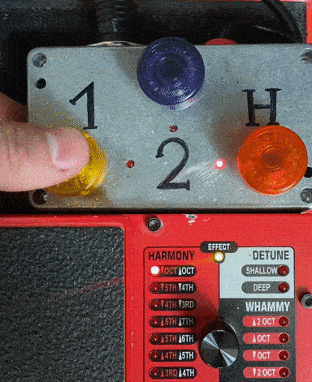
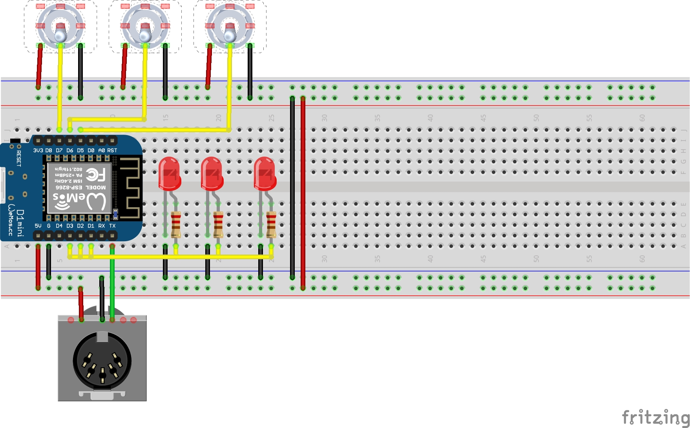
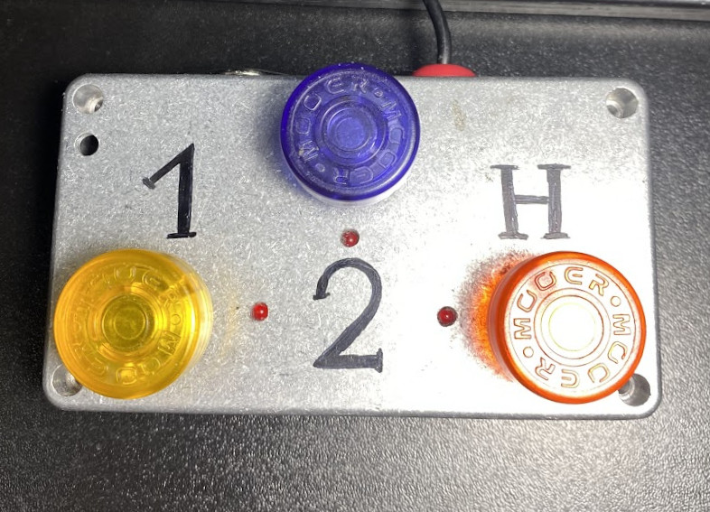
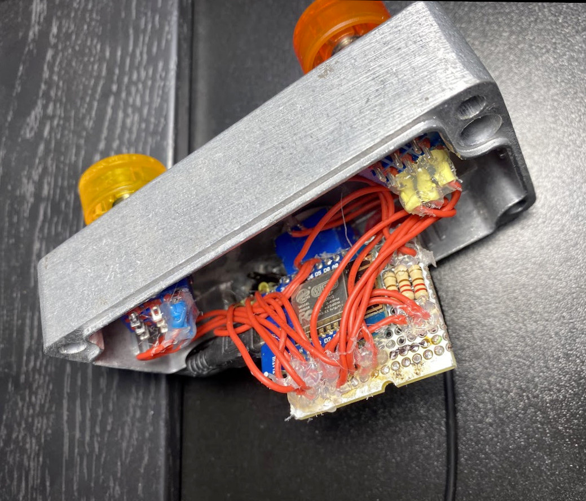

# Whammy IV MIDI controller

This controller switches modes on the Whammy IV - harmonic octave, 1 octave up, 2 octave up.

You can change the modes for yourself. See the [user manual](https://www.digitech.com/on/demandware.static/-/Sites-masterCatalog_Harman/default/dw18aa3ac1/pdfs/Whammy_OM_EN.pdf#14) for Digitech Whammy IV  at page 14 (MIDI channels). 

## Components
- Wemos D1 Mini or Arduino Nano
- MIDI output
- 3pdt switches
- LED's
- 200 om resistors
- corpus Gainta G0124
- [Arduino MIDI Library](https://github.com/FortySevenEffects/arduino_midi_library)

## Building scheme

## Images

